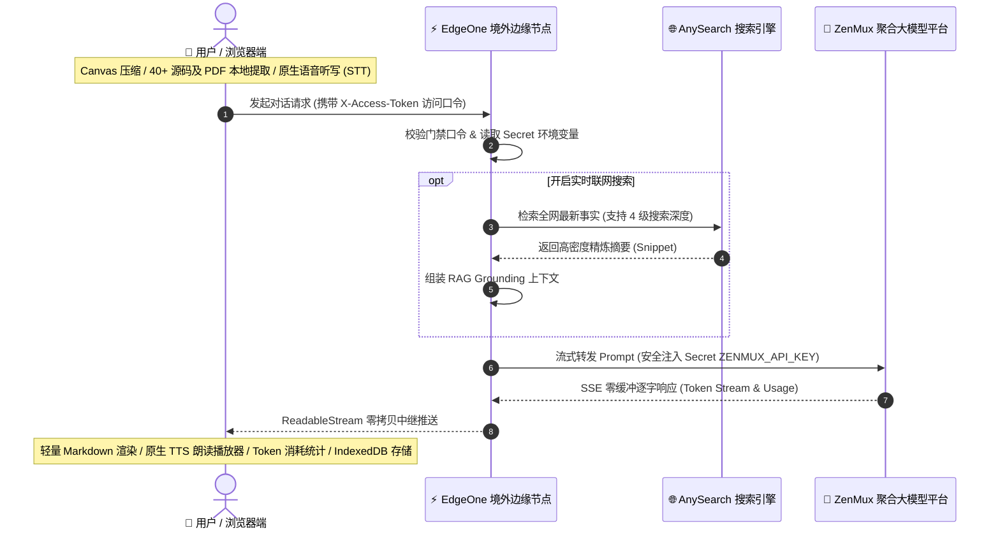

# ZenMux Chat

<p align="left">
  <b>简体中文</b> | <a href="./README_EN.md">English</a>
</p>

基于 **腾讯云 EdgeOne Pages 国际版（edgeone.ai）** 构建的高性能个人 AI 对话工作站：**现代极简前端 + 客户端全模态解析引擎 + 边缘函数安全反代 + AI 原生实时联网检索 + 纯原生神经语音双向交互**。

实现国内网络环境**无需代理直连**访问 ZenMux 平台全量大模型（OpenAI / Anthropic / Gemini / DeepSeek / Qwen / LLaMA 等），API Key 严密封装于边缘端，本地 IndexedDB 存储，月度维护成本 **¥0**。



| 架构层级 | 运行载体 | 核心职责与关键技术 |
| :--- | :--- | :--- |
| **💻 客户端层** | 本地浏览器 (Local-First) | Canvas 图像自适应压缩、40+ 源码/PDF 就地提取、原生语音合成 (TTS) 与听写 (STT)、双层移动端布局、IndexedDB 本地持久化 |
| **⚡ 边缘网关层** | EdgeOne 境外 Anycast 节点 | `X-Access-Token` 门禁鉴权、Secret 密钥安全隔离、参数自适应智能降级 (400 容错重试)、`X-Accel-Buffering: no` SSE 零缓冲中继 |
| **🌐 联网检索层** | AnySearch 搜索引擎 | AI 原生自然语言语义检索、高密度 Snippet 摘要提取、大幅节省 80%+ Tokens、4 级检索深度调节 |
| **🤖 算力供给层** | ZenMux 聚合平台 | 全量主流大模型无缝中继（DeepSeek-V3/R1、Claude 3.7/3.5、GPT-4o/o1/o3、Qwen 2.5 等） |

---

## 一、 核心设计理念（Design Rationale）

1. **解决跨境直连与网络阻断痛点**：
   ZenMux.ai 聚合了全球顶尖的商业与开源大模型，但在中国大陆常规网络环境下受阻。通过部署在 EdgeOne 国际版境外 Anycast 边缘节点，客户端发起一跳请求直达边缘节点，再由边缘节点同域转发至 ZenMux，**彻底摆脱了客户端代理工具的束缚**。
2. **核心资产安全隔离（API Key 永不落地）**：
   前端仅通过自定义访问口令（`ACCESS_TOKEN`）进行身份认证，ZenMux 与 AnySearch 的付费 `API_KEY` 仅存在于 EdgeOne 边缘加密 Secret 环境变量中，杜绝前端源码或抓包泄露风险。
3. **纯原生零成本双向语音体系（Zero-Cost Native Voice）**：
   - **TTS 语音朗读**：利用 W3C 标准 Web Speech API，智能识别当前浏览器并自动置顶最高品质音色（Edge 晓晓/云希 Neural、Apple 婷婷/Siri、Chrome 普通话），辅以专属下拉播放器与 0 延迟无损倍速调控；
   - **STT 语音听写**：输入框一键语音输入，字随声动实时转为文字，针对移动端做了单会话隔离与停顿提交。
4. **前置 AI 语义检索增强（Pre-Retrieval Dense RAG）**：
   抛弃传统大模型 Tool Call 带来的“双重网络延迟（4~8s）”与“双倍 Token 计费”，直接由 AI 原生搜索引擎进行自然语言语义召回，并注入精炼事实片段，**让全平台 100% 的大模型（包括纯推理思考模型）瞬间拥有毫秒级实时全网检索能力**。
5. **极致的零运维与零成本（Serverless & Local-First）**：
   - **计算前置（Client-Side Compute）**：图像重采样、PDF 解析、代码提取、Markdown 渲染与智能命名全部在用户本地浏览器完成，不消耗服务端任何昂贵算力；
   - **存储本地化（Local-First DB）**：对话历史与附件全量保存在本机的 `IndexedDB` 中，隐私安全且无需付费云数据库。

---

## 二、 核心功能与模块实现

### 1. 纯原生神经语音双向交互 (`Web Speech Engine`)
* **专属下拉音频播放器面板（`.msg-tts-player`）**：
  点击回复底部的 `[ 🔊 朗读 ]`，顺滑展开深色磨砂播放器：
  - **进度自由拖拽**：支持在进度条任意位置点击或拖动直接跳转（Seek）；
  - **0 延迟无损倍速胶囊**：提供 `0.75x`、`1.0x`、`1.25x`、`1.5x`、`2.0x`，原生即时调速无需重新请求；
  - **精选高保真白名单**：彻底过滤数十种系统搞笑杂音，仅保留顶级自然人声，并在各浏览器自动绑定最佳音色；
  - **GC 防断音驻留**：注入全局引用防回收机制，确保数分钟长文播放流畅连贯。
* **原生语音听写输入（`SpeechRecognition`）**：
  - 输入框一键点击说话，麦克风呈现呼吸发光录音态，字随声动实时注入输入框；
  - 智能环境适配与友好指引（iOS 提示使用 Safari，安卓引导配合键盘语音）。

### 2. 移动端双层复合输入布局 (`styles.css` & `index.html`)
* **移动端排版革命**：在手机或窄屏设备下，自动重构为双层布局：
  - **顶部功能条（`.composer-toolbar`）**：附件、联网搜索、语音输入集中排布在上方，触控间距舒适；
  - **底部整行输入区（`.composer-main-row`）**：输入框独享 100% 完整屏宽，彻底告别被多个按钮横向挤压的痛点。
* **桌面端自适应**：宽屏下自动还原为沉浸式一体化水平单行布局。

### 3. Token 消耗统计卡片与会话累计计数器
* **消息级消耗详情抽屉**：每轮 AI 回答操作栏紧跟 `[ ℹ️ X Tokens ]` 按钮，点击顺滑展开卡片，清晰呈现 **输入 Tokens、输出 Tokens、本轮总计、会话累计 Tokens 与响应模型**；
* **侧边栏全局计数器**：侧边栏底部实时显示当前会话的累计总 Token 消耗。

### 4. 模型无关自适应参数降级与容错重试 (`api/chat.js`)
* **全模型通用适配**：自动探测并适配不同模型对参数的苛刻要求（如 OpenAI `o1`/`o3` 与 Anthropic 对 `temperature` 或 `stream_options` 的报错）；
* **边缘自治重试**：当上游因弃用参数返回 HTTP 400 时，边缘函数自动剔除冲突字段并即时发起重试，对用户端完全透明。

### 5. 客户端多模态与文件解析引擎 (`app.js`)
* **图像智能降采样与压缩（`ImageProcessor`）**：
  在客户端利用 HTML5 Canvas 2D 进行自适应双线性插值压缩，将 5~15MB 原始图片无损压缩至 80~250KB，**完美规避边缘函数 1MB 请求体硬上限**；
* **代码与文档就地文本提取（`FileTextExtractor`）**：
  - **40+ 种格式原生秒读**：涵盖 `.py`, `.js`, `.ts`, `.go`, `.rs`, `.java`, `.c`, `.cpp`, `.sh`, `.sql`, `.json`, `.csv`, `.yaml`, `.xml`, `.log`, `.md` 等；
  - **PDF 按需分页解析**：动态加载 PDF.js 提取纯文本；
  - **标准上下文注入**：以 Markdown 围栏隔离注入 Prompt，让所有大模型均可直接分析长文档；
* **Token 容量防御安全阀**：单文件设立 10 万字符防御性截断机制。

### 6. 实时全网检索与多档位控制 (`api/search.js`)
* **AI 原生前置检索**：用户提问直接由搜索引擎进行意图分析与向量检索，提取高密度 Snippet 构建 Grounding Context，较抓取整页 HTML **节省 80%+ Prompt Token**；
* **4 级搜索深度调节**：
  - **`搜索 精炼` (3 条)**：极速低消耗，适合简单事实与天气查询；
  - **`搜索 标准` (5 条，默认)**：覆盖面与成本最佳，适合日常综合提问；
  - **`搜索 深度` (10 条)**：多源交叉核验，适合技术调研；
  - **`搜索 全面` (20 条)**：触达 API 物理上限，适合研报级事实汇总；
* **来源溯源卡片**：底部自适应渲染 `<details class="msg-sources">` 折叠卡片，包含序号、标题、域名与直达链接。

### 7. 高性能异步存储引擎 (`ZenMuxDB`)
* 基于浏览器原生 **IndexedDB**（数据库：`ZenMuxChatDB`，对象仓库：`conversations`）；
* 突破传统 `localStorage` 5MB 配额限制，支持海量历史会话、长文与图片数据的流畅持久化。

---

## 三、 快速部署指南

### 前置准备
1. **EdgeOne 国际站账号**：注册于 [edgeone.ai](https://edgeone.ai)（非腾讯云国内站）；
2. **GitHub 账号与代码仓库**：Fork 或推送本项目；
3. **自定义域名**：准备一个二级域名（如 `chat.yourdomain.com`），**免备案且无 401 限制**；
4. **ZenMux API Key**：在 [zenmux.ai](https://zenmux.ai) 控制台生成；
5. **AnySearch API Key** *(可选)*：在 [anysearch.com](https://anysearch.com) 控制台生成（用于联网搜索）。

---

### 部署步骤

#### 第 1 步：导入 EdgeOne Pages 项目
1. 登录 [edgeone.ai 控制台](https://edgeone.ai) → 进入 **Pages**（或 **Makers**）；
2. 点击 **Create project** → **Import a Git Repository** → 选择本仓库；
3. 构建配置填入：
   - **Framework Preset**: 留空或选择 `Other`
   - **Build Command**: 留空
   - **Output Directory**: `.`（一个英文点，表示项目根目录）
4. **Acceleration Region（加速区域）务必选择 `Global availability zone (exclude Chinese mainland)`**
   > ⚠️ **极为重要**：选择“全球可用区（不含中国大陆）”**完全免 ICP 备案**。
5. 点击 **Start deployment** 完成初次构建。

#### 第 2 步：绑定自定义域名与申请 SSL 证书
1. 进入项目页 → **Domain Management** → **Add custom domain**；
2. 填入您的二级域名（如 `chat.yourdomain.com`）；
3. 在域名解析服务商（Cloudflare / DNSPod / 阿里云等）添加 EdgeOne 给出的 **两项解析记录**：
   - **TXT 记录**（用于域名所有权校验）
   - **CNAME 记录**（用于流量接入调度）
4. 校验通过后，在域名列表点击 **HTTPS configuration** → 选择 **Apply for free certificate**（免费自动续期证书）并开启 **Force HTTPS Access**。

#### 第 3 步：配置环境变量（Secrets）
进入项目页 → **Settings** → **Environment Variables**，添加以下加密变量：

| 变量名 | 类型 | 说明 |
| :--- | :--- | :--- |
| `ZENMUX_API_KEY` | **Secret** | 在 zenmux.ai 获取的大模型 API 密钥 |
| `ACCESS_TOKEN` | **Secret** | 自行设定的前端访问口令（防止接口被盗刷） |
| `ANYSEARCH_API_KEY` | **Secret** | *(可选)* 在 anysearch.com 获取的检索密钥，用于开启实时全网联网搜索 |

添加完成后，点击项目右上角 **Redeploy** 重新部署以使变量生效。

---

## 四、 本地开发与联调

由于本项目前端为零依赖纯静态架构，可直接启动本地服务器：

```bash
# 方式 1：Node 本地预览
npm run dev

# 方式 2：Python 快速服务
python3 -m http.server 8088
```

如需在本地同时模拟 EdgeOne 边缘函数环境，可安装官方 CLI：
```bash
npm i -g edgeone
edgeone login
edgeone pages link
edgeone pages dev
```

---

## 五、 工程边界与注意事项 (Engineering Guardrails)

| 维度 | 限制与边界 | 应对与保障机制 |
| :--- | :--- | :--- |
| **边缘函数请求体上限** | 单次 POST 请求体约为 **1MB ~ 2MB** | 客户端 Canvas 自动将图片采样压缩至 200KB 内，保证多图请求依然稳健 |
| **函数执行生命周期** | Edge Functions 最长单次连接为 **120 秒** | 避免开启超长推理耗时任务，支持前端随时点击「■ 停止」中断流式 |
| **域名访问限制** | EdgeOne 默认赠送的 `*.edgeone.app` 在大陆访问会触发 401 限制 | 绑定免备案自定义域名并开启全球加速（不含大陆区）彻底解决 |
| **大模型上下文窗口** | 超大文件注入可能耗尽 Token 配额 | `FileTextExtractor` 设立 10 万字符防御性截断机制 |

---

## 六、 仓库目录结构

```text
├── index.html                  # 页面结构骨架、移动端双层复合输入框与操作工具条
├── styles.css                  # 现代化极简暗色主题、毛玻璃顶栏、TTS 播放器与响应式布局
├── app.js                      # 核心引擎：IndexedDB 存储、Canvas 压缩、TTS/STT 语音、流式与 Token 统计
├── edge-functions/
│   └── api/
│       ├── chat.js             # 边缘对话函数：鉴权校验、密钥注入、参数自适应降级与 SSE 零拷贝转发
│       ├── models.js           # 边缘模型函数：ZenMux 可用模型元数据安全代理
│       └── search.js           # 边缘检索函数：AnySearch 搜索引擎安全代理与鉴权中继
├── edgeone.json                # EdgeOne Pages 部署构建规范描述文件
├── package.json                # 项目元数据与开发命令
├── README.md                   # 中文说明文档
├── README_EN.md                # 英文说明文档 (English Documentation)
└── .env.example                # 环境变量配置模板参考
```
