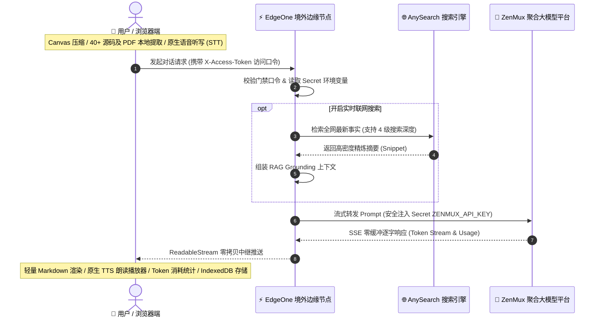
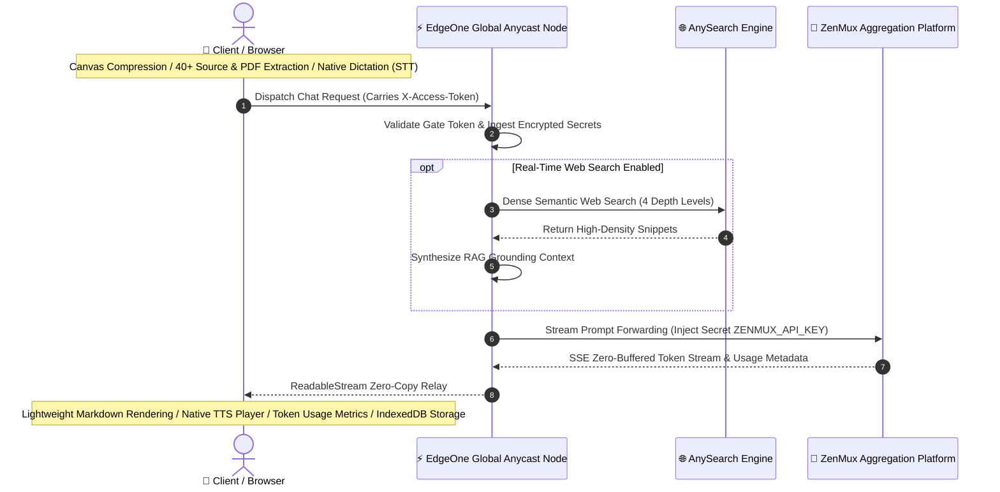

# ZenMux Chat

<p align="center">
  <b>高性能个人 AI 工作站 · 腾讯云 EdgeOne 边缘函数反代 · 纯原生双向神经语音 · 客户端全模态解析 · 零成本免代理直连</b>
</p>

---

<details open>
<summary><h2 style="display:inline-block; cursor:pointer;">🇨🇳 中文</h2></summary>

基于 **腾讯云 EdgeOne Pages 国际版（edgeone.ai）** 构建的高性能个人 AI 对话工作站：**现代极简前端 + 客户端全模态解析引擎 + 边缘函数安全反代 + AI 原生实时联网检索 + 纯原生神经语音双向交互**。

实现国内网络环境**无需代理直连**访问 ZenMux 平台全量大模型（OpenAI / Anthropic / Gemini / DeepSeek / Qwen / LLaMA 等），API Key 严密封装于边缘端，本地 IndexedDB 存储，月度维护成本 **¥0**。



| 架构层级 | 运行载体 | 核心职责与关键技术 |
| :--- | :--- | :--- |
| **💻 客户端层** | 本地浏览器 (Local-First) | Canvas 图像自适应压缩、40+ 源码/PDF 就地提取、原生语音合成 (TTS) 与听写 (STT)、双层移动端布局、IndexedDB 本地持久化 |
| **⚡ 边缘网关层** | EdgeOne 境外 Anycast 节点 | `X-Access-Token` 门禁鉴权、Secret 密钥安全隔离、参数自适应智能降级 (400 容错重试)、`X-Accel-Buffering: no` SSE 零缓冲中继 |
| **🌐 联网检索层** | AnySearch 搜索引擎 | AI 原生自然语言语义检索、高密度 Snippet 摘要提取、大幅节省 80%+ Tokens、4 级检索深度调节 |
| **🤖 算力供给层** | ZenMux 聚合平台 | 全量主流大模型无缝中继（DeepSeek-V3/R1、Claude 3.7/3.5、GPT-4o/o1/o3、Qwen 2.5 等） |

---

### 一、 核心设计理念（Design Rationale）

1. **解决跨境直连与网络阻断痛点**：
   ZenMux.ai 聚合了全球顶尖的商业与开源大模型，但在中国大陆常规网络环境下受阻。通过部署在 EdgeOne 国际版境外 Anycast 边缘节点，客户端发起一跳请求直达边缘节点，再由边缘节点同域转发至 ZenMux，**彻底摆脱了客户端代理工具的束缚**。
2. **核心资产安全隔离（API Key 永不落地）**：
   前端仅通过自定义访问口令（`ACCESS_TOKEN`）进行身份认证，ZenMux 与 AnySearch 的付费 `API_KEY` 仅存在于 EdgeOne 边缘加密 Secret 环境变量中，杜绝前端源码或抓包泄露风险。
3. **纯原生零成本双向语音体系（Zero-Cost Native Voice）**：
   - **TTS 语音朗读**：利用 W3C 标准 Web Speech API，智能识别当前浏览器并自动置顶最高品质音色（Edge 晓晓/云希 Neural、Apple 婷婷/Siri、Chrome 普通话），辅以专属下拉播放器与 0 延迟无损倍速调控；
   - **STT 语音听写**：输入框一键语音输入，字随声动实时转为文字，针对移动端做了单会话隔离与停顿提交。
4. **前置 AI 语义检索增强（Pre-Retrieval Dense RAG）**：
   抛弃传统大模型 Tool Call 带来的“双重网络延迟（4~8s）”与“双倍 Token 计费”，直接由 AI 原生搜索引擎进行自然语言语义召回，并注入精炼事实片段，**让全平台 100% 的大模型（包括纯推理思考模型）瞬间拥有毫秒级实时全网检索能力**。
5. **极致的零运维与零成本（Serverless & Local-First）**：
   - **计算前置（Client-Side Compute）**：图像重采样、PDF 解析、代码提取、Markdown 渲染与智能命名全部在用户本地浏览器完成，不消耗服务端任何昂贵算力；
   - **存储本地化（Local-First DB）**：对话历史与附件全量保存在本机的 `IndexedDB` 中，隐私安全且无需付费云数据库。

---

### 二、 核心功能与模块实现

#### 1. 纯原生神经语音双向交互 (`Web Speech Engine`)
* **专属下拉音频播放器面板（`.msg-tts-player`）**：
  点击回复底部的 `[ 🔊 朗读 ]`，顺滑展开深色磨砂播放器：
  - **进度自由拖拽**：支持在进度条任意位置点击或拖动直接跳转（Seek）；
  - **0 延迟无损倍速胶囊**：提供 `0.75x`、`1.0x`、`1.25x`、`1.5x`、`2.0x`，原生即时调速无需重新请求；
  - **精选高保真白名单**：彻底过滤数十种系统搞笑杂音，仅保留顶级自然人声，并在各浏览器自动绑定最佳音色；
  - **GC 防断音驻留**：注入全局引用防回收机制，确保数分钟长文播放流畅连贯。
* **原生语音听写输入（`SpeechRecognition`）**：
  - 输入框一键点击说话，麦克风呈现呼吸发光录音态，字随声动实时注入输入框；
  - 智能环境适配与友好指引（iOS 提示使用 Safari，安卓引导配合键盘语音）。

#### 2. 移动端双层复合输入布局 (`styles.css` & `index.html`)
* **移动端排版革命**：在手机或窄屏设备下，自动重构为双层布局：
  - **顶部功能条（`.composer-toolbar`）**：附件、联网搜索、语音输入集中排布在上方，触控间距舒适；
  - **底部整行输入区（`.composer-main-row`）**：输入框独享 100% 完整屏宽，彻底告别被多个按钮横向挤压的痛点。
* **桌面端自适应**：宽屏下自动还原为沉浸式一体化水平单行布局。

#### 3. Token 消耗统计卡片与会话累计计数器
* **消息级消耗详情抽屉**：每轮 AI 回答操作栏紧跟 `[ ℹ️ X Tokens ]` 按钮，点击顺滑展开卡片，清晰呈现 **输入 Tokens、输出 Tokens、本轮总计、会话累计 Tokens 与响应模型**；
* **侧边栏全局计数器**：侧边栏底部实时显示当前会话的累计总 Token 消耗。

#### 4. 模型无关自适应参数降级与容错重试 (`api/chat.js`)
* **全模型通用适配**：自动探测并适配不同模型对参数的苛刻要求（如 OpenAI `o1`/`o3` 与 Anthropic 对 `temperature` 或 `stream_options` 的报错）；
* **边缘自治重试**：当上游因弃用参数返回 HTTP 400 时，边缘函数自动剔除冲突字段并即时发起重试，对用户端完全透明。

#### 5. 客户端多模态与文件解析引擎 (`app.js`)
* **图像智能降采样与压缩（`ImageProcessor`）**：
  在客户端利用 HTML5 Canvas 2D 进行自适应双线性插值压缩，将 5~15MB 原始图片无损压缩至 80~250KB，**完美规避边缘函数 1MB 请求体硬上限**；
* **代码与文档就地文本提取（`FileTextExtractor`）**：
  - **40+ 种格式原生秒读**：涵盖 `.py`, `.js`, `.ts`, `.go`, `.rs`, `.java`, `.c`, `.cpp`, `.sh`, `.sql`, `.json`, `.csv`, `.yaml`, `.xml`, `.log`, `.md` 等；
  - **PDF 按需分页解析**：动态加载 PDF.js 提取纯文本；
  - **标准上下文注入**：以 Markdown 围栏隔离注入 Prompt，让所有大模型均可直接分析长文档；
* **Token 容量防御安全阀**：单文件设立 10 万字符防御性截断机制。

#### 6. 实时全网检索与多档位控制 (`api/search.js`)
* **AI 原生前置检索**：用户提问直接由搜索引擎进行意图分析与向量检索，提取高密度 Snippet 构建 Grounding Context，较抓取整页 HTML **节省 80%+ Prompt Token**；
* **4 级搜索深度调节**：
  - **`搜索 精炼` (3 条)**：极速低消耗，适合简单事实与天气查询；
  - **`搜索 标准` (5 条，默认)**：覆盖面与成本最佳，适合日常综合提问；
  - **`搜索 深度` (10 条)**：多源交叉核验，适合技术调研；
  - **`搜索 全面` (20 条)**：触达 API 物理上限，适合研报级事实汇总；
* **来源溯源卡片**：底部自适应渲染 `<details class="msg-sources">` 折叠卡片，包含序号、标题、域名与直达链接。

#### 7. 高性能异步存储引擎 (`ZenMuxDB`)
* 基于浏览器原生 **IndexedDB**（数据库：`ZenMuxChatDB`，对象仓库：`conversations`）；
* 突破传统 `localStorage` 5MB 配额限制，支持海量历史会话、长文与图片数据的流畅持久化。

---

### 三、 快速部署指南

#### 前置准备
1. **EdgeOne 国际站账号**：注册于 [edgeone.ai](https://edgeone.ai)（非腾讯云国内站）；
2. **GitHub 账号与代码仓库**：Fork 或推送本项目；
3. **自定义域名**：准备一个二级域名（如 `chat.yourdomain.com`），**免备案且无 401 限制**；
4. **ZenMux API Key**：在 [zenmux.ai](https://zenmux.ai) 控制台生成；
5. **AnySearch API Key** *(可选)*：在 [anysearch.com](https://anysearch.com) 控制台生成（用于联网搜索）。

#### 部署步骤
1. **导入项目**：登录 [edgeone.ai](https://edgeone.ai) → **Pages** → **Create project** → 选择本仓库；
2. **加速区域配置**：**Acceleration Region 务必选择 `Global availability zone (exclude Chinese mainland)`**（全球免备案）；
3. **构建配置**：Framework Preset 选 `Other`，Build Command 留空，Output Directory 填 `.`；
4. **绑定域名**：添加自定义二级域名，并在 DNS 处添加 TXT 与 CNAME 记录，开启免费 HTTPS；
5. **配置环境变量 (Secrets)**：在 **Settings** → **Environment Variables** 添加：
   - `ZENMUX_API_KEY`: ZenMux 聚合大模型 API Key
   - `ACCESS_TOKEN`: 自定义前端访问密码
   - `ANYSEARCH_API_KEY`: *(可选)* AnySearch 检索 Key
6. 点击 **Redeploy** 即可上线使用！

</details>

<br>

<details>
<summary><h2 style="display:inline-block; cursor:pointer;">🇺🇸 English</h2></summary>

A high-performance, serverless personal AI workstation built on **Tencent Cloud EdgeOne Pages (Global Edition - edgeone.ai)**: **Modern Minimalist UI + Client-Side Multimodal Parsing Engine + Secure Edge Function Proxy + AI-Native Real-Time Web Search + Native Neural Voice Integration**.

Enables **zero-proxy, high-speed direct access** to the full spectrum of state-of-the-art LLMs via the ZenMux platform (OpenAI / Anthropic / Gemini / DeepSeek / Qwen / LLaMA, etc.) within mainland China network environments. API keys remain strictly encapsulated within the edge runtime, paired with local IndexedDB persistence, incurring **¥0 monthly infrastructure overhead**.



| Architectural Tier | Execution Host | Core Responsibilities & Key Technologies |
| :--- | :--- | :--- |
| **💻 Client Tier** | Local Browser (Local-First) | Canvas adaptive image compression, 40+ code/PDF local extraction, Native TTS/STT, Dual-tier mobile layout, IndexedDB persistence |
| **⚡ Edge Gateway Tier** | EdgeOne Anycast Edge Nodes | `X-Access-Token` gate authentication, Secret encapsulation, Adaptive parameter self-healing (HTTP 400 pruning), `X-Accel-Buffering: no` SSE zero-copy relay |
| **🌐 Web Search Tier** | AnySearch Engine | AI-native semantic retrieval, dense snippet extraction saving 80%+ tokens, 4-tier granular search depth |
| **🤖 Compute Tier** | ZenMux Aggregation Platform | Seamless upstream connectivity across cutting-edge LLMs (DeepSeek-V3/R1, Claude 3.7/3.5, GPT-4o/o1/o3, Qwen 2.5, etc.) |

---

### 1. Core Design Philosophy

1. **Circumventing Cross-Border Network Latency & Blockades**:
   ZenMux.ai aggregates premier global commercial and open-source models, yet is hindered under conventional mainland Chinese networks. By deploying onto EdgeOne Global Anycast edge nodes, client requests travel in a single hop to offshore edge workers, which subsequently forward payloads within the same geographical zone—**completely obviating client-side proxy tools**.
2. **Defensive Cryptographic Isolation (API Keys Never Leak)**:
   The frontend authenticates solely via a custom gate token (`ACCESS_TOKEN`). Sensitive upstream `API_KEY`s for ZenMux and AnySearch reside strictly within EdgeOne's encrypted Secret environment variables, preventing exposure via client-side inspect tools or packet analysis.
3. **Zero-Cost Bidirectional Native Voice Ecosystem**:
   - **TTS Audio Player**: Built upon the W3C Web Speech API, with runtime browser-native sniffing that dynamically binds premier voices (Edge Xiaoxiao/Yunxi Neural, Apple Tingting/Siri, Chrome Mandarin), paired with an interactive collapsible drawer offering zero-latency `0.75x ~ 2.0x` lossless speed control;
   - **STT Voice Dictation**: One-touch voice input streaming live transcription into the textarea, optimized with session isolation and pause-commit heuristics for mobile devices.
4. **Pre-Retrieval Dense Semantic RAG (AnySearch Integration)**:
   Avoids traditional multi-step LLM Tool Calls that incur double round-trip latencies (4~8s) and excessive token billing. Natural language semantic queries retrieve dense fact snippets prior to generation, **endowing 100% of upstream models (including pure reasoning models) with real-time web search capability**.
5. **Radical Zero-Maintenance & Zero-Cost Footprint (Serverless & Local-First)**:
   - **Client-Side Compute**: Image downsampling, PDF parsing, source extraction, Markdown rendering, and title generation occur locally on the user's hardware;
   - **Local-First Persistence**: Conversation history and attachment metadata are persisted in `IndexedDB`, guaranteeing privacy with zero cloud database fees.

---

### 2. Feature Highlights & Technical Implementation

#### 1. Pure Native Neural Voice Interaction (`Web Speech Engine`)
* **Collapsible Audio Player Drawer (`.msg-tts-player`)**:
  Clicking `[ 🔊 Read Aloud ]` expands a frosted dark-themed audio control drawer:
  - **Interactive Seek Scrubbing**: Scrub or click any point along the timeline to seek instantly;
  - **Zero-Latency Lossless Speed Control**: Instantaneous `0.75x`, `1.0x`, `1.25x`, `1.5x`, and `2.0x` playback adjustments with 0ms network latency;
  - **Curated Whitelist Filter**: Strips dozens of legacy synthetic/novelty sound effects, retaining only studio-grade natural voices and auto-prioritizing the host OS default;
  - **GC Keep-Alive Protection**: Retains global active references to eliminate the notorious 15-second speech cutoff bug in Chromium/WebKit.
* **Native Voice Dictation (`SpeechRecognition`)**:
  - One-tap speech-to-text with animated glowing mic indicator, streaming words live into the textarea;
  - Intelligent fallback diagnostics (guiding iOS users to Safari and Android users to native keyboard voice typing).

#### 2. Dual-Tier Responsive Mobile Layout (`styles.css` & `index.html`)
* **Mobile Layout Paradigm**: On mobile viewports (`< 768px`), automatically switches to a dual-tier arrangement:
  - **Top Action Toolbar (`.composer-toolbar`)**: Attachment, web search, and voice dictation buttons are clustered above with comfortable 30px tap targets;
  - **Bottom Full-Width Input (`.composer-main-row`)**: The `<textarea id="input">` commands 100% full screen width, preventing horizontal compression.
* **Desktop Consistency**: Seamlessly transitions to a single horizontal integrated bar on widescreen displays.

#### 3. Granular Token Usage Metrics & Session Counter
* **Per-Turn Consumption Drawer**: Each assistant message features an `[ ℹ️ X Tokens ]` button that smoothly reveals **Prompt Tokens, Completion Tokens, Turn Total, Cumulative Session Tokens, and Model Metadata**;
* **Sidebar Global Counter**: Real-time cumulative token expenditure displayed in the sidebar footer.

#### 4. Model-Agnostic Parameter Pruning & Autonomous Fallback (`api/chat.js`)
* **Universal Compatibility**: Intelligently normalizes payloads across disparate model schemas (e.g., pruning unsupported `temperature` or `stream_options` on OpenAI `o1`/`o3` or Anthropic);
* **Edge Autonomous Retry**: Automatically strips conflicting parameters and retries upon HTTP 400 responses, remaining entirely transparent to the user.

#### 5. Client Multimodal & File Parsing Engine (`app.js`)
* **Adaptive Canvas Downsampling (`ImageProcessor`)**:
  Uses HTML5 Canvas 2D bilinear interpolation to compress 5~15MB raw images down to 80~250KB, **bypassing EdgeOne's 1MB request body threshold**;
* **In-Place Source & Document Extraction (`FileTextExtractor`)**:
  - **40+ Extensions Natively Parsed**: `.py`, `.js`, `.ts`, `.go`, `.rs`, `.java`, `.c`, `.cpp`, `.sh`, `.sql`, `.json`, `.csv`, `.yaml`, `.xml`, `.log`, `.md`, etc.;
  - **On-Demand PDF Parsing**: Dynamically ingests PDF.js to extract text;
  - **Semantic Context Isolation**: Encapsulates files within Markdown fences to allow file analysis on all text models;
* **Context Capacity Guardrail**: 100,000 character defensive truncation threshold prevents token overflow.

#### 6. Real-Time Web Search with 4 Depth Levels (`api/search.js`)
* **AI-Native Dense RAG**: Ingests concise fact snippets, saving **80%+ prompt tokens** compared to raw HTML scraping;
* **Granular Search Depth**:
  - **`Search Quick` (3 results)**: Minimal latency and low token usage;
  - **`Search Standard` (5 results, default)**: Optimal balance of coverage and cost;
  - **`Search Deep` (10 results)**: Multi-source validation for technical research;
  - **`Search Pro` (20 results)**: Maximum API threshold for comprehensive fact aggregation;
* **Source Attribution Cards**: Expandable `<details class="msg-sources">` drawer displaying indices, titles, domains, and outbound URLs.

#### 7. High-Capacity Asynchronous Storage (`ZenMuxDB`)
* Built on browser-native **IndexedDB** (`ZenMuxChatDB`, Object Store: `conversations`);
* Overcomes the 5MB `localStorage` ceiling, accommodating extensive chat histories, long-form documents, and image assets.

---

### 3. Quick Deployment Guide

#### Prerequisites
1. **EdgeOne Global Account**: Registered at [edgeone.ai](https://edgeone.ai) (offshore edition);
2. **GitHub Account & Repository**: Fork or push this repository;
3. **Custom Domain**: A secondary domain (e.g., `chat.yourdomain.com`), **ICP-exempt with no 401 restrictions**;
4. **ZenMux API Key**: Generated via [zenmux.ai](https://zenmux.ai);
5. **AnySearch API Key** *(Optional)*: Generated via [anysearch.com](https://anysearch.com) for real-time web search.

#### Deployment Steps
1. **Import Project**: Log in to [edgeone.ai](https://edgeone.ai) → **Pages** → **Create project** → Select this repository;
2. **Acceleration Region**: **MUST select `Global availability zone (exclude Chinese mainland)`** (100% ICP exempt);
3. **Build Config**: Framework Preset `Other`, Build Command leave empty, Output Directory `.`;
4. **Bind Domain**: Add your secondary custom domain, configure TXT and CNAME DNS records, enable free HTTPS;
5. **Configure Secrets**: In **Settings** → **Environment Variables**, add:
   - `ZENMUX_API_KEY`: API key from zenmux.ai
   - `ACCESS_TOKEN`: Custom client-side access gate token
   - `ANYSEARCH_API_KEY`: *(Optional)* Search API key from anysearch.com
6. Click **Redeploy** to take changes live!

</details>

---

## 仓库目录结构 / Repository Structure

```text
├── index.html                  # 页面结构骨架、移动端双层复合输入框与操作工具条
├── styles.css                  # 现代化极简暗色主题、毛玻璃顶栏、TTS 播放器与响应式布局
├── app.js                      # 核心引擎：IndexedDB 存储、Canvas 压缩、TTS/STT 语音、流式与 Token 统计
├── edge-functions/
│   └── api/
│       ├── chat.js             # 边缘对话函数：鉴权校验、密钥注入、参数自适应降级与 SSE 零拷贝转发
│       ├── models.js           # 边缘模型函数：ZenMux 可用模型元数据安全代理
│       └── search.js           # 边缘检索函数：AnySearch 搜索引擎安全代理与鉴权中继
├── edgeone.json                # EdgeOne Pages 部署构建规范描述文件
├── package.json                # 项目元数据与开发命令
├── README.md                   # 统一双语说明文档 (Unified Bilingual Documentation)
└── .env.example                # 环境变量配置模板参考
```
