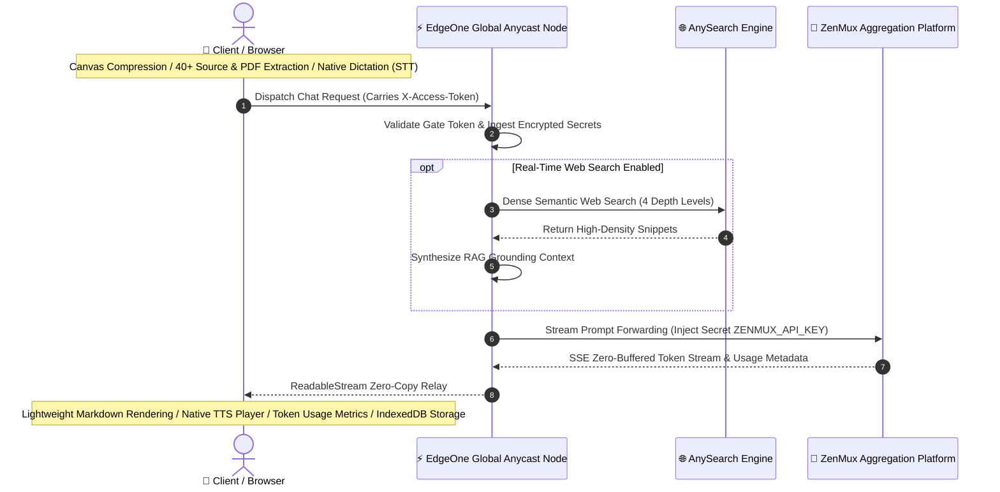

# ZenMux Chat

<p align="left">
  <a href="./README.md">简体中文</a> | <b>English</b>
</p>

A high-performance, serverless personal AI workstation built on **Tencent Cloud EdgeOne Pages (Global Edition - edgeone.ai)**: **Modern Minimalist UI + Client-Side Multimodal Parsing Engine + Secure Edge Function Proxy + AI-Native Real-Time Web Search + Native Neural Voice Integration**.

Enables **zero-proxy, high-speed direct access** to the full spectrum of state-of-the-art LLMs via the ZenMux platform (OpenAI / Anthropic / Gemini / DeepSeek / Qwen / LLaMA, etc.) within mainland China network environments. API keys remain strictly encapsulated within the edge runtime, paired with local IndexedDB persistence, incurring **¥0 monthly infrastructure overhead**.



| Architectural Tier | Execution Host | Core Responsibilities & Key Technologies |
| :--- | :--- | :--- |
| **💻 Client Tier** | Local Browser (Local-First) | Canvas adaptive image compression, 40+ code/PDF local extraction, Native TTS/STT, Dual-tier mobile layout, IndexedDB persistence |
| **⚡ Edge Gateway Tier** | EdgeOne Anycast Edge Nodes | `X-Access-Token` gate authentication, Secret encapsulation, Adaptive parameter self-healing (HTTP 400 pruning), `X-Accel-Buffering: no` SSE zero-copy relay |
| **🌐 Web Search Tier** | AnySearch Engine | AI-native semantic retrieval, dense snippet extraction saving 80%+ tokens, 4-tier granular search depth |
| **🤖 Compute Tier** | ZenMux Aggregation Platform | Seamless upstream connectivity across cutting-edge LLMs (DeepSeek-V3/R1, Claude 3.7/3.5, GPT-4o/o1/o3, Qwen 2.5, etc.) |

---

## 1. Core Design Philosophy

1. **Circumventing Cross-Border Network Latency & Blockades**:
   ZenMux.ai aggregates premier global commercial and open-source models, yet is hindered under conventional mainland Chinese networks. By deploying onto EdgeOne Global Anycast edge nodes, client requests travel in a single hop to offshore edge workers, which subsequently forward payloads within the same geographical zone—**completely obviating client-side proxy tools**.
2. **Defensive Cryptographic Isolation (API Keys Never Leak)**:
   The frontend authenticates solely via a custom gate token (`ACCESS_TOKEN`). Sensitive upstream `API_KEY`s for ZenMux and AnySearch reside strictly within EdgeOne's encrypted Secret environment variables, preventing exposure via client-side inspect tools or packet analysis.
3. **Zero-Cost Bidirectional Native Voice Ecosystem**:
   - **TTS Audio Player**: Built upon the W3C Web Speech API, with runtime browser-native sniffing that dynamically binds premier voices (Edge Xiaoxiao/Yunxi Neural, Apple Tingting/Siri, Chrome Mandarin), paired with an interactive collapsible drawer offering zero-latency `0.75x ~ 2.0x` lossless speed control;
   - **STT Voice Dictation**: One-touch voice input streaming live transcription into the textarea, optimized with session isolation and pause-commit heuristics for mobile devices.
4. **Pre-Retrieval Dense Semantic RAG (AnySearch Integration)**:
   Avoids traditional multi-step LLM Tool Calls that incur double round-trip latencies (4~8s) and excessive token billing. Natural language semantic queries retrieve dense fact snippets prior to generation, **endowing 100% of upstream models (including pure reasoning models) with real-time web search capability**.
5. **Radical Zero-Maintenance & Zero-Cost Footprint (Serverless & Local-First)**:
   - **Client-Side Compute**: Image downsampling, PDF parsing, source extraction, Markdown rendering, and title generation occur locally on the user's hardware;
   - **Local-First Persistence**: Conversation history and attachment metadata are persisted in `IndexedDB`, guaranteeing privacy with zero cloud database fees.

---

## 2. Feature Highlights & Technical Implementation

### 1. Pure Native Neural Voice Interaction (`Web Speech Engine`)
* **Collapsible Audio Player Drawer (`.msg-tts-player`)**:
  Clicking `[ 🔊 Read Aloud ]` expands a frosted dark-themed audio control drawer:
  - **Interactive Seek Scrubbing**: Scrub or click any point along the timeline to seek instantly;
  - **Zero-Latency Lossless Speed Control**: Instantaneous `0.75x`, `1.0x`, `1.25x`, `1.5x`, and `2.0x` playback adjustments with 0ms network latency;
  - **Curated Whitelist Filter**: Strips dozens of legacy synthetic/novelty sound effects, retaining only studio-grade natural voices and auto-prioritizing the host OS default;
  - **GC Keep-Alive Protection**: Retains global active references to eliminate the notorious 15-second speech cutoff bug in Chromium/WebKit.
* **Native Voice Dictation (`SpeechRecognition`)**:
  - One-tap speech-to-text with animated glowing mic indicator, streaming words live into the textarea;
  - Intelligent fallback diagnostics (guiding iOS users to Safari and Android users to native keyboard voice typing).

### 2. Dual-Tier Responsive Mobile Layout (`styles.css` & `index.html`)
* **Mobile Layout Paradigm**: On mobile viewports (`< 768px`), automatically switches to a dual-tier arrangement:
  - **Top Action Toolbar (`.composer-toolbar`)**: Attachment, web search, and voice dictation buttons are clustered above with comfortable 30px tap targets;
  - **Bottom Full-Width Input (`.composer-main-row`)**: The `<textarea id="input">` commands 100% full screen width, preventing horizontal compression.
* **Desktop Consistency**: Seamlessly transitions to a single horizontal integrated bar on widescreen displays.

### 3. Granular Token Usage Metrics & Session Counter
* **Per-Turn Consumption Drawer**: Each assistant message features an `[ ℹ️ X Tokens ]` button that smoothly reveals **Prompt Tokens, Completion Tokens, Turn Total, Cumulative Session Tokens, and Model Metadata**;
* **Sidebar Global Counter**: Real-time cumulative token expenditure displayed in the sidebar footer.

### 4. Model-Agnostic Parameter Pruning & Autonomous Fallback (`api/chat.js`)
* **Universal Compatibility**: Intelligently normalizes payloads across disparate model schemas (e.g., pruning unsupported `temperature` or `stream_options` on OpenAI `o1`/`o3` or Anthropic);
* **Edge Autonomous Retry**: Automatically strips conflicting parameters and retries upon HTTP 400 responses, remaining entirely transparent to the user.

### 5. Client Multimodal & File Parsing Engine (`app.js`)
* **Adaptive Canvas Downsampling (`ImageProcessor`)**:
  Uses HTML5 Canvas 2D bilinear interpolation to compress 5~15MB raw images down to 80~250KB, **bypassing EdgeOne's 1MB request body threshold**;
* **In-Place Source & Document Extraction (`FileTextExtractor`)**:
  - **40+ Extensions Natively Parsed**: `.py`, `.js`, `.ts`, `.go`, `.rs`, `.java`, `.c`, `.cpp`, `.sh`, `.sql`, `.json`, `.csv`, `.yaml`, `.xml`, `.log`, `.md`, etc.;
  - **On-Demand PDF Parsing**: Dynamically ingests PDF.js to extract text;
  - **Semantic Context Isolation**: Encapsulates files within Markdown fences to allow file analysis on all text models;
* **Context Capacity Guardrail**: 100,000 character defensive truncation threshold prevents token overflow.

### 6. Real-Time Web Search with 4 Depth Levels (`api/search.js`)
* **AI-Native Dense RAG**: Ingests concise fact snippets, saving **80%+ prompt tokens** compared to raw HTML scraping;
* **Granular Search Depth**:
  - **`Search Quick` (3 results)**: Minimal latency and low token usage;
  - **`Search Standard` (5 results, default)**: Optimal balance of coverage and cost;
  - **`Search Deep` (10 results)**: Multi-source validation for technical research;
  - **`Search Pro` (20 results)**: Maximum API threshold for comprehensive fact aggregation;
* **Source Attribution Cards**: Expandable `<details class="msg-sources">` drawer displaying indices, titles, domains, and outbound URLs.

### 7. High-Capacity Asynchronous Storage (`ZenMuxDB`)
* Built on browser-native **IndexedDB** (`ZenMuxChatDB`, Object Store: `conversations`);
* Overcomes the 5MB `localStorage` ceiling, accommodating extensive chat histories, long-form documents, and image assets.

---

## 3. Quick Deployment Guide

### Prerequisites
1. **EdgeOne Global Account**: Registered at [edgeone.ai](https://edgeone.ai) (offshore edition);
2. **GitHub Account & Repository**: Fork or push this repository;
3. **Custom Domain**: A secondary domain (e.g., `chat.yourdomain.com`), **ICP-exempt with no 401 restrictions**;
4. **ZenMux API Key**: Generated via [zenmux.ai](https://zenmux.ai);
5. **AnySearch API Key** *(Optional)*: Generated via [anysearch.com](https://anysearch.com) for real-time web search.

---

### Step-by-Step Deployment

#### Step 1: Import Project to EdgeOne Pages
1. Log in to the [edgeone.ai Console](https://edgeone.ai) → Navigate to **Pages** (or **Makers**);
2. Click **Create project** → **Import a Git Repository** → Select this repository;
3. Fill in build configurations:
   - **Framework Preset**: Leave empty or select `Other`
   - **Build Command**: Leave empty
   - **Output Directory**: `.` (a single period representing the repository root)
4. **Acceleration Region MUST be configured as `Global availability zone (exclude Chinese mainland)`**
   > ⚠️ **Crucial**: Selecting this region ensures **complete exemption from Chinese ICP registration**.
5. Click **Start deployment** to initiate the initial build.

#### Step 2: Bind Custom Domain & Issue SSL Certificate
1. Open project details → **Domain Management** → **Add custom domain**;
2. Enter your custom domain (e.g., `chat.yourdomain.com`);
3. Add the two DNS records provided by EdgeOne at your DNS registrar (Cloudflare, DNSPod, Route53, etc.):
   - **TXT Record** (Ownership validation)
   - **CNAME Record** (Traffic routing)
4. Once verified, navigate to **HTTPS configuration** → select **Apply for free certificate** and enable **Force HTTPS Access**.

#### Step 3: Configure Environment Variables (Secrets)
Go to **Settings** → **Environment Variables**, and add the following encrypted variables:

| Variable Name | Type | Description |
| :--- | :--- | :--- |
| `ZENMUX_API_KEY` | **Secret** | LLM aggregation API key obtained from zenmux.ai |
| `ACCESS_TOKEN` | **Secret** | Custom client-side access gate token to prevent unauthorized usage |
| `ANYSEARCH_API_KEY` | **Secret** | *(Optional)* Search API key from anysearch.com for real-time web grounding |

After adding, click **Redeploy** in the top right corner to apply the secrets.

---

## 4. Local Development & Debugging

As the frontend is built with zero-dependency static assets, launch locally with any HTTP server:

```bash
# Option 1: Node preview server
npm run dev

# Option 2: Python quick server
python3 -m http.server 8088
```

To emulate the EdgeOne Edge Functions runtime locally, install the official CLI:
```bash
npm i -g edgeone
edgeone login
edgeone pages link
edgeone pages dev
```

---

## 5. Engineering Guardrails

| Dimension | Constraint | Mitigation & Protective Architecture |
| :--- | :--- | :--- |
| **Edge Request Body Limit** | Single POST payload capped at **1MB ~ 2MB** | Client-side Canvas compresses images to under 200KB, sustaining multi-image requests |
| **Function Execution Timeout** | Max Edge Function streaming duration is **120 seconds** | Fast dense search prevents timeouts; users can interrupt generation via the `■ Stop` button |
| **Default Domain Access** | Default `*.edgeone.app` domains return 401 within mainland China | Binding an ICP-exempt custom domain with global acceleration completely resolves this |
| **Context Window Limits** | Excessive file text can exhaust token budgets | `FileTextExtractor` enforces a 100k character defensive truncation barrier |

---

## 6. Project Directory Structure

```text
├── index.html                  # HTML5 markup, dual-tier responsive composer, attachment tray
├── styles.css                  # Modern minimalist dark theme, frosted topbar, TTS audio player, responsive layout
├── app.js                      # Core engine: IndexedDB, Canvas compression, TTS/STT, streaming & token tracking
├── edge-functions/
│   └── api/
│       ├── chat.js             # Edge chat worker: Auth validation, secret injection, parameter self-healing, SSE relay
│       ├── models.js           # Edge models worker: Secure metadata proxy for available ZenMux models
│       └── search.js           # Edge search worker: AnySearch proxy and RAG grounding relay
├── edgeone.json                # EdgeOne Pages build and deployment specification
├── package.json                # Project metadata and development scripts
├── README.md                   # Chinese Documentation (简体中文)
├── README_EN.md                # English Documentation (English)
└── .env.example                # Template for environment variables
```
