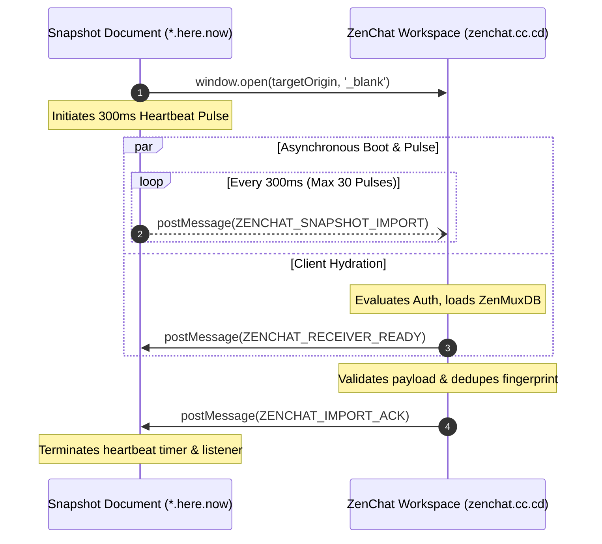
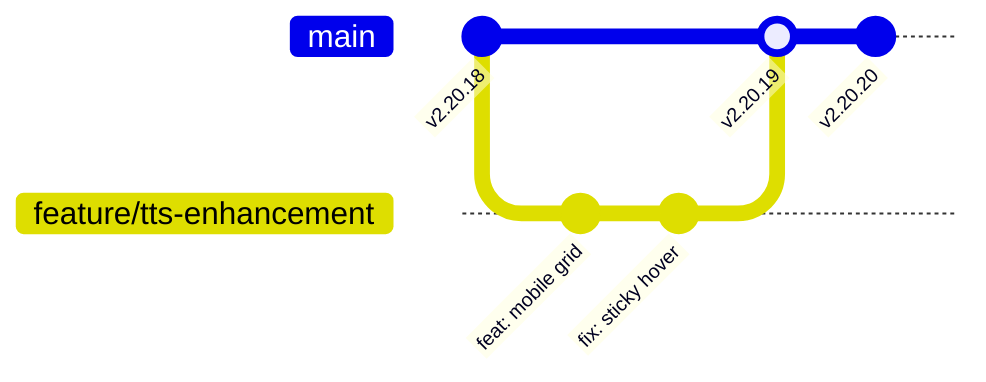

# Architectural Specification: ZenMux Chat Distributed Workstation

This document serves as the canonical technical architectural specification for ZenMux Chat. It details the distributed topology, compute planes, multimodal model orchestration pipelines, universal client convergence runtime, and automated GitOps release lifecycle.

---

## 1. System Mission & Core Architectural Principles

ZenMux Chat is architected as an edge-native, zero-infrastructure AI computing workstation. It diverges deliberately from conventional heavy full-stack frameworks, adopting a minimalist, high-velocity paradigm governed by the following core dogmas:

1. **Occam's Razor in Implementation**: Elimination of superfluous abstractions, frameworks, and build layers. The client runtime is pure Vanilla ECMAScript Modules (ESM) and standard CSS custom properties.
2. **Edge-First Compute Placement**: Shifting API routing, token protection, and streaming data normalization to Tencent Cloud EdgeOne Anycast V8 isolates, achieving sub-10ms global ingress latency.
3. **Unified Multimodal Ingestion Plane**: Centralizing all textual inference, acoustic transcription, neural speech synthesis, and generative vision through the unified ZenMux gateway protocol.
4. **Universal Client Convergence**: Maintaining a single immutable frontend codebase that operates interchangeably as an Anycast web application, a Progressive Web App (PWA), and a native Android application via Capacitor.
5. **Deterministic Environmental Parity**: Automating multi-branch deployments on EdgeOne Pages with `main` serving global production and non-main branches acting as isolated preview sandboxes.

---

## 2. End-to-End System Topology

```mermaid
graph TB
    subgraph ClientStratum ["Universal Client Stratum (Cross-Platform)"]
        Browser["Desktop / Mobile Browser"]
        PWA["PWA Instance (Service Worker: sw.js)"]
        CapAndroid["Capacitor Native Android Container"]
        ClientCore["Vanilla ESM Core (app.js, state.js, chat.js, tts.js)"]
        
        Browser --> ClientCore
        PWA --> ClientCore
        CapAndroid --> ClientCore
    end

    subgraph EdgeOneStratum ["Tencent Cloud EdgeOne Edge Computing Stratum"]
        EdgeCDN["Anycast Global CDN PoPs (Static Assets /dist)"]
        
        subgraph V8EdgeWorkers ["V8 Edge Functions (/api/...)"]
            AuthGate["Gate Verifier & Secret Guard"]
            ChatProxy["Chat Completion & CoT Proxy"]
            TTSProxy["TTS Stream Normalizer & Aggregator"]
            ASRProxy["ASR Whisper Multipart Relay"]
            PluginGate["External Tool Call Relay (/api/plugins/*)"]
            ShareGateway["Share & Snapshot Gateway (/api/share)"]
        end
        
        subgraph CloudFnStratum ["Node.js Cloud Functions"]
            HeavyWorkers["Extended Duration Tasks (> 60s)"]
        end
        
        EdgeCDN -.-> V8EdgeWorkers
        V8EdgeWorkers -.-> CloudFnStratum
    end

    subgraph HereNowStratum ["here.now Managed Hosting Plane"]
        HereNowAPI["here.now REST API (api.here.now)"]
        R2Storage["Cloudflare R2 Binary Storage"]
        HereNowAPI -.-> R2Storage
    end

    subgraph ZenMuxGatewayStratum ["ZenMux Unified Intelligence Plane"]
        ZenMuxAPI["ZenMux Anycast API Gateway (api.zenmux.ai)"]
        
        subgraph ModelFoundry ["Upstream Foundation Model Providers"]
            LLMs["LLMs & Reasoning: Google Gemini, Anthropic Claude, xAI Grok, DeepSeek"]
            Vision["Generative Vision: Recraft V3, Flux Pro / Schnell"]
            ASRModels["Acoustic Transcription: Whisper Large V3"]
            TTSModels["Speech Synthesis: Gemini 3.1 TTS, Grok Voice, Qwen Audio"]
        end
        
        ZenMuxAPI --> LLMs
        ZenMuxAPI --> Vision
        ZenMuxAPI --> ASRModels
        ZenMuxAPI --> TTSModels
    end

    ClientCore -->|Static Pre-Cached Assets| EdgeCDN
    ClientCore -->|Encrypted API Ingestion| V8EdgeWorkers
    V8EdgeWorkers -->|HTTPS Proxy & Bearer Auth| ZenMuxAPI
    ClientCore -->|Phase 1 (Prepare) & Phase 3 (Finalize)| ShareGateway
    ShareGateway -->|Publish Manifest & Finalize| HereNowAPI
    ClientCore -->|Phase 2: Direct Presigned Binary Stream PUT| R2Storage
```

---

## 3. Compute & Hosting Stratum (Tencent Cloud EdgeOne)

The deployment and compute topology is partitioned into two complementary serverless tiers:

### 3.1 Edge Functions (`edge-functions/api/`)
- **Runtime Environment**: High-performance V8 edge workers operating on Tencent Cloud Anycast edge nodes worldwide.
- **Latency Profile**: Zero cold starts, execution initiates in sub-millisecond timeframes directly at the nearest point of presence (PoP).
- **Core Responsibilities**:
  - Verification of access passphrases (`/api/verify-gate`).
  - Secure credential injection: Environment secrets (`ZENMUX_API_KEY`, plugin keys) are injected into outgoing upstream headers, never leaking to the client.
  - Streaming Server-Sent Events (SSE) pipe forwarding with header sanitization (`.trim()`).
  - Dynamic Session Title Synthesis (`/api/title`): Single-turn, non-streaming session summarization restricted strictly to free text models, stripping internal thinking tags and enforcing language-matched length boundaries (English: 4-10 words, Chinese: 4-12 characters).
  - Master Exception Boundary: Every handler encapsulates logic within `try / catch (fatalErr)` blocks returning structured `{ error, detail }` JSON, completely insulating workers from runtime crashes (`HTTP 545`).

### 3.2 Cloud Functions (`cloud-functions/`)
- **Runtime Environment**: Node.js 22 serverless container runtime.
- **Execution Ceiling**: Up to 120 seconds duration threshold configured in [`edgeone.json`](file:///Users/mac/Github/zenmux-chat/edgeone.json).
- **Core Responsibilities**: Extended computational workflows, batch document synthesis, and large binary transforms exceeding Edge Worker memory or execution limits.

### 3.3 Static Edge Distribution (`/dist`)
- Production artifacts generated by `scripts/build.js` are deployed to Anycast edge storage.
- Global cache headers guarantee immutable asset caching for hashed files and Stale-While-Revalidate delivery for core entry documents (`index.html`, `version.json`).

### 3.4 Session Save & Share Gateway (`/api/share`) & Static Hosting Plane
- **Managed Credential Isolation**: Edge functions encapsulate static hosting credentials, preventing client-side API key exposure while orchestrating direct-to-storage snapshot distribution.
- **Entity-Anchored Permalinking Model**:
  - Shared snapshots are anchored to the generating assistant message's immutable creation timestamp and message UUID.
  - Snapshot metadata (`slug`, `siteUrl`, `expiresAt`, `sharedAt`, `ttlDays`) is persisted in-situ on `asstMsg.share` inside `ZenMuxDB`.
  - Subsequent share invocations on the same turn execute a 0ms fast path by retrieving the cached record from local storage without duplicate uploads.
- **In-Place Version Mutation (`PUT /publish/{slug}`)**:
  - Modifying dyads or toggles on an active turn updates the existing snapshot under the identical URL.
  - In-place version updates bypass quota eviction routines and preserve persistent site identifiers.
- **Three-Phase Presigned Storage Upload Protocol**:
  1. **Phase 1 (Prepare / Stage)**: Client submits session metadata to `/api/share`. The edge gateway coordinates with the hosting control plane and returns presigned storage upload URLs and headers.
  2. **Phase 2 (Direct Binary Ingestion)**: Client streams the compiled HTML byte buffer directly from the browser to cloud object storage, bypassing edge server body size limits.
  3. **Phase 3 (Atomic Finalization)**: Client posts confirmation to `/api/share` to activate the uploaded version and obtain the canonical live URL.
- **High-Assurance Delivery Contract**:
  - **Autonomous Clipboard Ingestion**: Writes `siteUrl` directly to the OS clipboard upon snapshot finalization.
  - **Active Hyperlink Component**: Exposes an interactive anchor element with inline link preview, status animations, and external navigation.
- **Dual-Engine Link Rotation & Quota Preservation**:
  - *Engine I (Native TTL)*: Built-in expiry automatically decaying snapshots after configured durations (7 days default, 14 days, 30 days, or indefinite).
  - *Engine II (Proactive Capacity Surveillance)*: Automated surveillance checks active sites against account quota ceilings, pruning oldest sites prior to staging new deployments.
- **Hermetic Media Inlining**:
  - Document synthesizer transcodes local blob references and remote image URLs into Base64 Data URIs, guaranteeing immutable document fidelity in perpetuity.
- **JSON Data Island & Peer-to-Peer "Fork in ZenChat" Handshake**:
  - **Embedded Data Island**: The compiled snapshot encapsulates the raw conversation model, prompt-response history, and token usage into a hermetic `<script type="application/json" id="zenchat-snapshot-data">` block with script breakout protection.
  - **Dynamic Origin Resolution (`resolveAppOrigin()`)**: Evaluates host origin at snapshot compile time, embedding `<meta name="zenchat:app-origin" content="...">` for seamless cross-domain navigation.
  - **Peer-to-Peer Cross-Window Handshake**:
    - Importing shared conversations is strictly constrained to direct user interaction on the published snapshot document via the "Fork in ZenChat" control.
    - Operates entirely in-memory via W3C `window.postMessage`, completely eliminating cross-origin fetch restrictions and external proxy dependencies.
    - Employs a bidirectional handshake (`ZENCHAT_RECEIVER_READY`, `ZENCHAT_SNAPSHOT_IMPORT`, `ZENCHAT_IMPORT_ACK`) with heartbeat retry pulsing and fingerprint deduplication.
    - Queues payloads automatically if the receiving window is locked behind access gates, hydrating immediately upon unlock.



- **SVG Symbol Sprite Deflation**:
  - Reusable iconography is consolidated into a hidden SVG sprite (`<symbol id="...">`), allowing interaction buttons to reference symbols via `<use href="#id">` and significantly compressing the compiled HTML payload.

---

## 4. Multimodal Model Orchestration Plane (ZenMux)

ZenMux acts as the universal intelligence plane, normalizing diverse upstream APIs into OpenAI-compatible paradigms.

### 4.1 Reasoning, Chain-of-Thought (CoT) & Session Synthesis
- **Protocol**: OpenAI-compatible chat completion stream (`/v1/chat/completions`, `stream: true`).
- **Reasoning Dispatch Specification**:
  - `Reasoning Default`: Parameter omitted; ZenMux automatically applies default intensity (`medium`).
  - `Reasoning Effort Levels` (`minimal`, `low`, `medium`, `high`): Dispatched via `reasoning_effort: "<level>"`.
  - `Reasoning Off`: Dispatched via ZenMux canonical control schema `reasoning: { enabled: false }` (decoupling from non-standard effort enums).
  - `Edge Self-Healing Resiliency`: Edge proxies intercept upstream HTTP 400/422 rejections (e.g. models where reasoning cannot be disabled or unsupported parameter fields), prune conflicting fields, and retry in-flight.
- **Dynamic Session Title Synthesis**:
  - Edge gateway (`/api/title`) leverages first-turn context, filtering images/files and instructing a fast, free LLM under tight constraints (4-10 English words / 4-12 Chinese characters) with heuristic fallback.
- **Telemetry Parsing**: The client stream accumulator dynamically detects reasoning attributes (`reasoning`, `reasoning_content`) and renders collapsible deliberation sections with real-time token tracking.
- **Token Accounting**: Captures prompt, completion, and cumulative session token usage at the conclusion of every stream turn.

### 4.2 Acoustic Speech Transcription & Dual Voice Paradigms (ASR & Silero ONNX VAD)
- **Dual Voice Capture Paradigms**:
  - **Mode A: Tactile Push-to-Talk (Default)**: Pointer-event driven recording state machine with hold-to-speak threshold filtering, dynamic gesture cancellation, and multisensory feedback (haptic vibration engine and an elevated floating HUD island to prevent thumb occlusion).
  - **Mode B: Hands-Free Neural VAD**: Integrates Silero VAD v5 ONNX WebAssembly (`silero_vad.onnx`, 2.2MB) with WebAssembly SIMD acceleration, computing real-time speech probabilities across 512-sample Float32 frames with autonomous energy fallback.
- **Upstream Gateway**: Encodes 16kHz mono WAV audio with 85Hz highpass filtering and DC detrending, forwarding payloads via `edge-functions/api/audio.js` to ZenMux Whisper transcription (`/v1/audio/transcriptions`).

### 4.3 Neural Speech Synthesis (TTS) Pipeline
- **Streaming Audio Protocol**: Transmits text payloads with `stream: true` to `/v1/audio/speech`, receiving SSE chunks:
  ```http
  data: {"type":"speech.audio.delta","audio":"<base64-encoded-pcm-chunk>","mime_type":"audio/L16;rate=24000"}
  data: {"type":"speech.audio.done","usage":{"input_tokens":5,"output_tokens":109,"total_tokens":114}}
  data: [DONE]
  ```
- **Client Accumulator & Live Duration**: Incoming Base64 PCM fragments are concatenated into an `Int16Array` and packaged into a WAV container. Synthesized audio duration is calculated in real time:
  $$\text{Duration (seconds)} = \frac{\text{Total Audio Bytes}}{\text{Sample Rate} \times 2}$$
- **Model Voice Catalogs & Defensive Normalization**:
  - **Google Gemini 3.1 Flash TTS**: `Kore` (default), `Puck`, `Aoede`, `Fenrir`, `Charon`.
  - **xAI Grok Voice TTS 1.0**: `Ara` (default), `Eve`, `Leo`, `Rex`, `Sal`.
  - **Alibaba Qwen-Audio-3.0-TTS-Plus**: `longanlingxin` (default), `longanlufeng`, `loongalexanderhubase`, `loongivyhubase`.
  - **Defensive Edge Normalizer**: Anycast edge workers validate incoming voice parameters against model-specific registries. Out-of-spec or stale voices are automatically mapped to the target model's recommended default voice, preventing upstream API validation rejections.
- **Session Memory Cache**: Rendered audio is stored in an in-memory `Map` keyed by message ID and voice configuration, eliminating redundant network calls during repeated playback or scrubber scrubbing.

### 4.4 Generative Vision Architecture
- Translates image requests into generative parameters for Recraft V3 and Flux Pro.
- Automatically handles prompt enhancement, resolution selection, inline thumbnail generation, and full-resolution lightbox viewing.

### 4.5 Built-in Tool Calling & Extensible Plugin Matrix
- **Single Source of Truth (`js/plugins.js`)**: Encapsulates all tool calling schemas, system instruction injections, CoT reasoning tags, and UI source card renderers.
- **Generic Execution Pipeline (`js/chat.js`)**: Completely decoupled from specific plugin implementations, delegating schema aggregation and tool response injection to `PluginRegistry`.

---

## 5. Universal Client Runtime

### 5.1 Technology Stack & Source Sequestration (`src/` Architecture)
- **Source Sequestration**: All client-side code (`src/index.html`, `src/styles.css`, `src/js/`, `src/assets/`) is cleanly sequestered under `src/`. The build orchestrator (`scripts/build.js`) compiles and projects this tree into the production distribution directory (`dist/`), which is consumed identically by EdgeOne Pages, Android WebView, and GitHub Pages.
- **Core**: Vanilla HTML5 and ECMAScript Modules (ESM). Zero third-party Virtual-DOM libraries.
- **Styling**: Vanilla CSS utilizing custom properties for light (Claude-inspired warm palette) and dark (charcoal and lilac) themes.
- **Ergonomic Design**:
  - Touch-safe interactions: Dedicated `@media (hover: hover) and (pointer: fine)` rules isolating mouse hover from touchscreen gestures.
  - Optical centering compensation on geometric controls.
  - Responsive two-tier CSS Grid layouts on mobile viewports ($\le 640\text{px}$).

### 5.2 Progressive Web App (PWA) & Service Worker Protocol
- **Lifecycle Invalidation (`sw.js`)**: Controlled by the centralized cache identifier:
  $$\text{CACHE\_NAME} = \text{"zenchat-shell-vX.Y.Z"}$$
- **Cache Strategy**:
  - **Static Shell Assets**: Pre-cached during worker installation (`/`, `/index.html`, `/styles.css`, `/js/app.js`).
  - **API & Audio Requests**: Bypasses service worker cache completely, routed directly over the network to edge functions.
  - **Garbage Collection**: Activation lifecycle automatically purges all legacy cache buckets differing from the active `CACHE_NAME`, claiming client tabs immediately.

### 5.3 Capacitor Native Android Integration
- **Project Structure**: Native Android shell located under `android/`.
- **Synchronization Workflow**:
  - Compile web bundle: `npm run build`
  - Synchronize web assets into Android project: `npx cap sync android`
  - Compile native debug APK: `cd android && ./gradlew assembleDebug`
- **Native Privileges**: Access to hardware audio microphones for ASR transcription and native background audio playback.

### 5.4 Zero-Reload Bilingual Internationalization (`js/i18n.js`)
- **Micro-Engine Architecture**: Zero-dependency, sub-10KB reactive localization engine supporting real-time runtime toggling between Simplified Chinese (`zh-CN`) and English (`en-US`).
- **Declarative DOM Hydration & English Baseline**: Directives (`data-i18n*`) update in-place without page reload. Static HTML maintains an English compile-time baseline with pre-login Gate localization to eliminate untranslated flash (FOUC).
- **Strict Tool Contract Invariance**: Programmatic LLM tool calling schemas (`PluginRegistry.getAll()`) remain strictly 100% English to preserve model reasoning reliability, while UI indicators and citations adapt dynamically via `languagechange` events.
- **Symmetric Key Parity Gate**: Enforces 100% parity across all 293 keys validated by `scratch/test_i18n.js`.

---

## 6. GitOps, Semantic Versioning & CI/CD Pipeline



### 6.1 Multi-Branch Staging & Preview Architecture
- **Production Trunk (`origin/main`)**: Every commit pushed to `main` triggers a production build on EdgeOne Pages (`npm run build`), deploying to the canonical production URL.
- **Ephemeral Preview Deployments**: Feature branches pushed to GitHub automatically provision unique preview environments under `edgeone.ai`, enabling empirical QA and integration testing on real edge infrastructure prior to merging.

### 6.2 Single Source of Truth (SSOT) Version Management
- Versioning is strictly centralized in `package.json`.
- The synchronization utility `scripts/bump.js` automatically cascades version updates across:
  - `package.json` (`version`)
  - `js/state.js` (`APP_VERSION`)
  - `sw.js` (`CACHE_NAME`)
  - `version.json` (runtime telemetry endpoint)
- `index.html` dynamically hydrates all `.app-version-badge` DOM elements at runtime.

### 6.3 Pre-Commit Verification Gate
Before staging and committing revisions, all code must pass deterministic quality gates:
1. **Syntax Integrity**: `node --check` across all modified JavaScript and Edge Function modules.
2. **Production Bundle Compilation**: `npm run build` must complete with zero errors.
3. **Scratch Simulation**: Verification of upstream API schemas using isolated scripts under `scratch/`.
4. **Style Compliance**: Zero emojis across all source code, documentation, and Git commit messages.
5. **Atomic Commit & Push**: Commit and push operations are executed in lockstep to maintain synchronicity with remote repositories.
